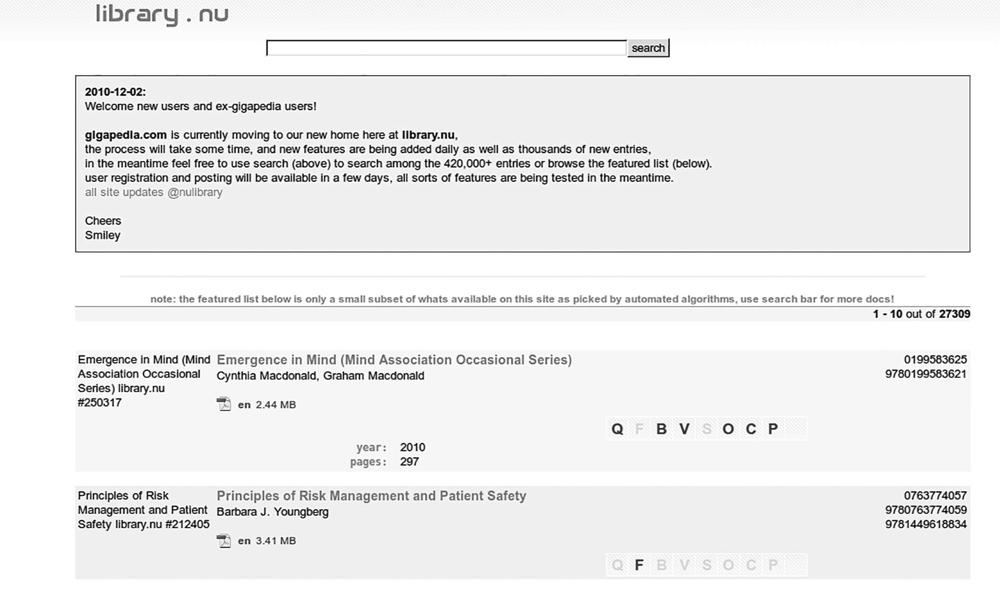
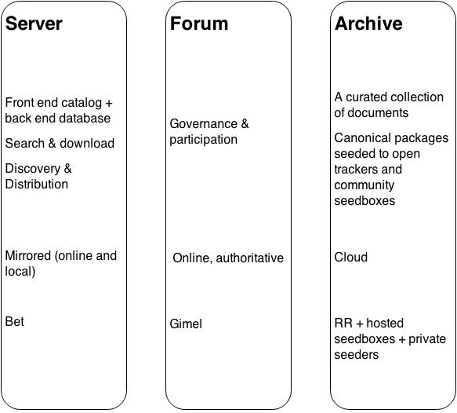

> Literature is the secretion of civilization, poetry of the ideal. That is why literature is one of the wants of societies. That is why poetry is a hunger of the soul. That is why poets are the first instructors of the people. That is why Shakespeare must be translated in France. That is why Molière must be translated in England. That is why comments must be made on them. That is why there must be a vast public literary domain. That is why all poets, all philosophers, all thinkers, all the producers of the greatness of the mind must be translated, commented on, published, printed, reprinted, stereotyped, distributed, explained, recited, spread abroad, given to all, given cheaply, given at cost price, given for nothing.
[@hugo_works_1907, p. 230]

<<<<<<< HEAD
### Introduction
The big money (and the bandwidth) in online media is in film, music, and software. Text is less profitable for copyright holders; it is cheaper to duplicate and easier to share. Consequently, issues surrounding the unsanctioned sharing of print material receive less press and scant academic attention. The very words, "book piracy," fail to capture the spirit of what is essentially an Enlightenment-era project openly embodied in many contemporary "shadow libraries"^[@liang_shadow_2012]: in the words of Victor Hugo, to establish a "vast public literary domain." Writers, librarians, and political activists from Hugo to Leo Tolstoy and Andrew Carnegie have long argued for unrestricted access to information as a form of a public good essential to civic engagement. In that sense, people participating in online book exchanges enact a role closer to that of a librarian than that of a bootlegger or a plagiarist. Whatever the reader's stance on the ethics of copyright and copyleft, book piracy should not be dismissed as mere search for free entertainment. Under the conditions of "digital disruption,"^[<http://web.archive.org/web/20140110160431/http://go.proquest.com/libraries-at-the-center-of-the-digital-disruption>] when the traditional institutions of knowledge dissemination—the library, the university, the newspaper, and the publishing house—feel themselves challenged and transformed by the internet, we can look to the online book sharing community for lessons in participatory governance, technological innovation, and economic sustainability.

The primary aims of this paper are ethnographic and descriptive: to study and to learn from a library that constitutes one of the world's largest digital archives, rivaling *Google Books*, *Hathi Trust*, and *Europeana*. In approaching a "thick description" of this archive we begin broaching questions of scope and impact. We would like to ask: Who? Where? and Why? What kind of people distribute books online? What motivates their activity? What technologies enable the sharing of print media? And what lessons can we draw from them? Our secondary aim is to begin the work of contextualizing the phenomenon of book sharing. The traditional story of peer production is one of altruistic participation. But the very history of public libraries is one that combines the impulse to share and to protect. To paraphrase @derrida_archive_1995 writing in "Archive Fever," the archive shelters memory just as it shelters itself from memory. We encompass this dual dynamic under the term "peer preservation," where the logistics of "peers" and of "preservation" can sometimes work at odds with one another.

Academic literature tends to view piracy on the continuum between free culture and intellectual property rights. On the one side, an argument is made for unrestricted access to information as a prerequisite to properly deliberative democracy.^[@benkler_wealth_2006, p. 92; @schuler_information_2004; @dimaggio_social_2001, p. 320; @papacharissi_virtual_2002, p. 22] On this view, access to knowledge is a form of political power, which must be equitably distributed, redressing regional and social imbalances of access.^[@benkler_wealth_2006, p. 442; @castells_communication_2007, p. 251; @lessig_free_2004; @shirky_here_2008, p. 153] The other side offers pragmatic reasoning related to the long-term sustainability of the cultural sphere, which, in order to prosper, must provide proper economic incentives to content creators.^[@day_defense_2010, @posner. For further discussion see @calandrillo_economic_1998, p. 306; @cohen_creativity_2006; @hughes_philosophy_1988, p. 303.] I
=======
### Introduction 
The big money (and the bandwidth) in online media is in film, music, and software. Text is less profitable for copyright holders; it is cheaper to duplicate and easier to share. Consequently, issues surrounding the unsanctioned sharing of print material receive less press and scant academic attention. The very words, "book piracy," fail to capture the spirit of what is essentially an Enlightenment-era project, openly embodied in many contemporary "shadow libraries"^[@liang_shadow_2012]: in the words of Victor Hugo, to establish a "vast public literary domain." Writers, librarians, and political activists from Hugo to Leo Tolstoy and Andrew Carnegie have long argued for unrestricted access to information as a form of a public good essential to civic engagement. In that sense, people participating in online book exchanges enact a role closer to that of a librarian than that of a bootlegger or a plagiarist. Whatever the reader's stance on the ethics of copyright and copyleft, book piracy should not be dismissed as mere search for free entertainment. Under the conditions of "digital disruption,"^[http://web.archive.org/web/20140110160431/http://go.proquest.com/libraries-at-the-center-of-the-digital-disruption] when the traditional institutions of knowledge dissemination—the library, the university, the newspaper, and the publishing house—feel themselves challenged and transformed by the internet, we can look to online book sharing communities for lessons in participatory governance, technological innovation, and economic sustainability.

The primary aims of this paper are ethnographic and descriptive: to study and to learn from a library that constitutes one of the world's largest digital archives, rivaling *Google Books*, *Hathi Trust*, and *Europeana*. In approaching a "thick description" of this archive we begin to broach questions of scope and impact. We would like to ask: Who? Where? and Why? What kind of people distribute books online? What motivates their activity? What technologies enable the sharing of print media? And what lessons can we draw from them? Our secondary aim is to continue the work of exploring the phenomenon of book sharing more widely, placing it in the context of other commons-based peer production communities like Project Gutenberg and Wikipedia. The archetypal model of peer production is one motivated by altruistic participation. But the very history of public libraries is one that combines the impulse to share and to protect. To paraphrase @derrida_archive_1995 writing in "Archive Fever," the archive shelters memory just as it shelters itself from memory. We encompass this dual dynamic under the term "peer preservation," where the logistics of "peers" and of "preservation" can sometimes work at adds to one another.

Academic literature tends to view piracy on the continuum between free culture and intellectual property rights. On the one side, an argument is made for unrestricted access to information as a prerequisite to properly deliberative democracy^[@benkler_wealth_2006, p. 92; @schuler_information_2004; @dimaggio_social_2001, p. 320; @papacharissi_virtual_2002, p. 22]. On this view, access to knowledge is a form of political power, which must be equitably distributed, redressing regional and social imbalances of access^[@benkler_wealth_2006, p. 442; @castells_communication_2007, p. 251; @lessig_free_2004; @shirky_here_2008, p. 153]. The other side offers pragmatic reasoning related to the long-term sustainability of the cultural sphere, which, in order to prosper, must provide proper economic incentives to content creators.^[@day, @posner. For further discussion see @calandrillo_economic_1998, p. 306; @cohen_creativity_2006; @hughes_philosophy_1988, p. 303.] I
>>>>>>> 1fc77852473c8eb3e767fc73d84912ba158fc927

It is our contention that grassroots file sharing practices cannot be understood solely in terms of access or intellectual property. Our field work shows that while some members of the book sharing community participate for activist or ideological reasons, others do so as collectors, preservationists, curators, or simply readers. Despite romantic notions to the contrary, reading is a social and mediated activity. The reader encounters texts in conversation, through a variety of physical interfaces and within an ecosystem of overlapping communities, each projecting their own material contexts, social norms, and ideologies. A technician who works in a biology laboratory, for example, may publish closed-access peer-review articles by day, as part of his work collective, and release terabytes of published material by night, in the role of a moderator for an online digital library. Our approach then, is to capture some of the complexity of such an ecosystem, particularly in the liminal areas where people, texts, and technology converge.

### Ethics disclaimer
Research for this paper was conducted under the aegis of piracyLab, an academic collective exploring the impact of technology on the spread of knowledge globally.^[<http://piracylab.org>] One of the lab's first tasks was to discuss the ethical challenges of collaborative research in this space. The conversation involved students, faculty, librarians, and informal legal council. Neutrality, to the extent that it is possible, emerged as one of our foundational principles. To keep all channels of communication open, we wanted to avoid bias and to give voice to a diversity of stakeholders: from authors, to publishers, to distributors, whether sanctioned or not. Following a frank discussion and after several iterations, we drafted an ethics charter that continues to inform our work today. The charter contains the following provisions:

- We neither condone nor condemn any forms of information exchange.
- We strive to protect our sources and do not retain any identifying personal information.
- We seek transparency in sharing our methods, data, and findings with the widest possible audience.
- Credit where credit is due. We believe in documenting attribution thoroughly.
- We limit our usage of licensed material to the analysis of metadata, with results used for non-commercial, nonprofit, educational purposes.
- Lab participants commit to abiding by these principles as long as they remain active members of the research group.

In accordance with these principles and following the practice of scholars like @bodo_set_2012, @lobato_cyberlocker_2013 and @priest_future_2006, we redact the names of file sharing services and user names, where such names are not made explicitly public elsewhere.

### Centralization 
We begin with the intuition that all infrastructure is social to an extent. Even private library collections cannot be said to comprise the work of a single individual. Collective forces shape furniture, books, and the very cognitive scaffolding that enables reading and interpretation. Yet, there are significant qualitative differences in the systems underpinning private collections, public libraries, and unsanctioned peer-to-peer information exchanges like Pirate Bay, for example. Given these differences, the recent history of online book sharing can be roughly divided into two periods. The first is characterized by local, ad-hoc peer-to-peer document exchanges and the subsequent growth of centralized content aggregators. Following trends in the development of the web as a whole, shadow libraries of the second period are characterized by communal governance and distributed infrastructure. 

Shadow libraries of the first period resemble a private library in that they often emanated from a single authoritative source--a site of collection and distribution associated with an individual collector, sometimes explicitly. The library of Maxim Moshkov, for example, established in 1994 and still thriving at *lib.ru*, is one of the most visible collections of that kind. Despite their success, such libraries are limited in scale by the means and efforts of a few individuals. Due to their centralized architecture they are also susceptible to legal challenges from copyright owners and to state intervention. Shadow libraries responded to these problems by distributing labor, responsibility, and infrastructure, resulting in a system that is more robust, more redundant, and more resistant to any single point of failure or control.

The case of *Gigapedia* (later *library.nu*) and its related file hosting service *ifile.it* illustrates the successes and failures of the centralized digital library model. Arguably among the largest and most popular virtual libraries online in the period of 2009-2011, the sites were operated by Irish nationals[^LN3] on domains registered in Italy and on the island state of Niue, with servers on the territory of Germany and Ukraine. At its peak, *library.nu* (LNU) hosted more than 400,000 books and was purported to make an "estimated turnover of EUR 8 million (USD 10,602,400) from advertising revenues, donations and sales of premium-level accounts," at least according to a press release made by the International Publishers Association (IPA).[^LN1]

Its apparent popularity notwithstanding, *Gigapedia* was supported by relatively simple architecture, likely maintained by a single developer / administrator. The site itself consisted of a catalog of digital books and related metadata, including title, author, year of publication, number of pages, description, category classification, and a number of boolean parameters (whether the file is bookmarked, paginated, vectorized, is searchable, and has a cover). The catalog also contained a link to *ifile.it*, a "cyberlocker" service that hosted many of the actual files themselves. On 15th of February 2012, in a Munich court, the IPA, in conjunction with a consortium of international publishing houses and the help of the German law firm Lausen Rechtsanwalte,[^LN2] served judicial cease-and-desist orders naming both sites (*Gigapedia* and *ifile.it*). Seventeen injunctions were sought in Ireland, with the consequent voluntary shut-down of both domains, which for a brief time redirected visitors first to *Google Books* and then to *Blue Latitudes*, a *New York Times* bestseller about pirates, for sale on *Amazon*. 

The relatively brief, by library standards, existence of LNU underscores the weakness of the single-source digital library model. The site flourished as long as it did not attract the ire of the publishing industry. The lack of redundancy in the site's administrative structure paralleled the lack of redundancy on the server level. Once the authorities established the identity of the site's operators (via Paypal receipts, according to a partner at Lausen Rechtsanwalte), the site was forced to shut down irrevocably.^[@losowsky_book_2012] The system's single point of origin proved also to be its single point of failure.

[^LN1]: http://web.archive.org/web/20140110160254/http://www.internationalpublishers.org/ipa-press-releases/286-publishers-strike-major-blow-against-internet-piracy
[^LN2]: Including the German Publishers and Booksellers Association, Cambridge University Press, Georg Thieme, Harper Collins, Hogrefe, Macmillan Publishers Ltd., Cengage Learning, Elsevier, John Wiley & Sons, The McGraw-Hill Companies, Pearson Education Ltd., Pearson Education Inc., Oxford University Press, Springer, Taylor & Francis, C.H. Beck as well as Walter De Gruyter. The legal proceedings are also supported by the Association of American Publishers (AAP), the Dutch Publishers Association (NUV), the Italian Publishers Association (AIE) and the International Association of Scientific Technical and Medical Publishers (STM).
[^LN3]: The injunctions name I\* and F\* N\* (also known as Smiley).

<<<<<<< HEAD
<<<<<<< HEAD
Jens Bammel, Secretary General of the IPA, called the action "an important step towards a more transparent, honest and fair trade of digital content on the Internet."^[<http://web.archive.org/web/20140110160254/http://www.internationalpublishers.org/ipa-press-releases/286-publishers-strike-major-blow-against-internet-piracy>] The rest of the internet mourned the passage of "the greatest, largest and the best website for downloading eBooks"^[<http://archive.is/g205>], comparing the demise of *Gigapedia* to the burning of the ancient Library of Alexandria.^[<https://web.archive.org/web/20140113135846/http://breakingculture.tumblr.com/post/17697325088/gigapedia-rip>] Readers from around the world flocked to sites like *Reddit* and *TorrentFreak* to express their support and anger. A reader of *TorrentFreak* wrote:
=======
Jens Bammel, Secretary General of the IPA, called the action "an important step towards a more transparent, honest and fair trade of digital content on the Internet."^[http://web.archive.org/web/20140110160254/http://www.internationalpublishers.org/ipa-press-releases/286-publishers-strike-major-blow-against-internet-piracy] The rest of the internet mourned the passage of "the greatest, largest and the best website for downloading eBooks"^[http://archive.is/g205], comparing the demise of *LNU/Gigapedia* to the burning of the ancient Library of Alexandria.^[https://web.archive.org/web/20140113135846/http://breakingculture.tumblr.com/post/17697325088/gigapedia-rip] Readers from around the world flocked to sites like *Reddit* and *TorrentFreak* to express their support and anger. For example, one reader wrote on *TorrentFreak*:
>>>>>>> 1fc77852473c8eb3e767fc73d84912ba158fc927
=======
Jens Bammel, Secretary General of the IPA, called the action "an important step towards a more transparent, honest and fair trade of digital content on the Internet."^[http://web.archive.org/web/20140110160254/http://www.internationalpublishers.org/ipa-press-releases/286-publishers-strike-major-blow-against-internet-piracy] The rest of the internet mourned the passage of "the greatest, largest and the best website for downloading eBooks"^[http://archive.is/g205], comparing the demise of *Gigapedia* to the burning of the ancient Library of Alexandria.^[https://web.archive.org/web/20140113135846/http://breakingculture.tumblr.com/post/17697325088/gigapedia-rip] Readers from around the world flocked to sites like *Reddit* and *TorrentFreak* to express their support and anger. A reader of *TorrentFreak* writes:
>>>>>>> parent of 1fc7785... many small changes, closed issue 6

> I live in Macedonia (the Balkans), a country where the average salary is somewhere around 200eu, and I’m a student, attending a MA degree in communication sci. [...] where I come from the public library is not an option. [...] Our libraries are so poor, mostly containing 30year or older editions of books that almost never refer to the field of communication or any other contemporary science. My professors never hide that they use sites like library.nu [...] Original textbooks [...] are copy-printed handouts of some god knows how obtained original [...] For a country like Macedonia and the Balkans region generally THIS IS A APOCALYPTIC SCALE DISASTER! I really feel like the dark age is just around the corner these days.^[<https://web.archive.org/web/20140110050710/http://torrentfreak.com/book-publishers-shut-down-library-nu-and-ifile-it-120215>]

A similar comment on *Reddit* reads:

> This is the saddest news of the year...heart-breaking...shocking...I was so attached to this site...I am from a third world country where buying original books is way too expensive if we see currency exchange rates...library.nu was a sea of knowledge for me and I learnt a lot from it [...] RIP library.nu...you have ignited several minds with free knowledge.^[<https://web.archive.org/web/20140110050450/http://www.reddit.com/r/trackers/comments/ppfwc/librarynu_admin_the_website_is_shutting_down_due>]

Another redditor writes:

> This was an invaluable resource for international academics. The catalog of libraries overseas often cannot meet the needs of researchers in fields not specific to the country in which they are located. My doctoral research has taken a significant blow due to this recent shutdown [...]  Please publishers, if you take away such a valuable resource, realize that you have created a gap that will be filled. This gap can either be filled by you or by us.^[<https://web.archive.org/web/20140110050450/http://www.reddit.com/r/trackers/comments/ppfwc/librarynu_admin_the_website_is_shutting_down_due>]

Another concludes:

> This just makes me want to start archiving everything I can get my hands on.^[<https://web.archive.org/web/20140110050450/http://www.reddit.com/r/trackers/comments/ppfwc/librarynu_admin_the_website_is_shutting_down_due>]

These anecdotal reports confirm our own experiences of studying and teaching at universities with a diverse audience of international students, who often recount a similar personal narrative. *Gigapedia* and analogous sites fulfilled an unmet need in the international market, redressing global inequities of access to information.[^LNKARA]

[^LNKARA]: This point is made at length in the report on media piracy in emerging economies, released by the American Assembly in 2011. See @karaganis_media_2011, p.i. 

<<<<<<< HEAD
<<<<<<< HEAD
But, being a single-source, cyberlocker-based service, *Gigapedia* failed to cultivate a community (even though it supported a forum for brief periods of its existence). As @lobato_cyberlocker_2013 write in their paper on cyberlocker-based media distribution systems, cyberlockers in general "do not foster collaboration and co-creation," taking an "instrumental view" of file sharing, where "no attempt is made to curate, organize, or archive the hosted content."^[@lobato_cyberlocker_2013, p. 9] Although not strictly a cyberlocker, *Gigapedia* fit the profile of a passive, non-transformative site by these criteria.  For Lobato and Tang, the rapid disappearance of many prominent cyberlocker sites underscores the "structural instability" of "fragile" file sharing communities.^[@lobato_cyberlocker_2013, p. 7] In our case, it would be more precise to say that cyberlocker architecture highlights merely the structural instability of single-source media archives, and not of file sharing communities in general. Although bereaved readers were concerned about the irrevocable loss of a valuable resource, digital libraries that followed built a model of file sharing that is more resilient, more transparent, and more participatory than their *Gigapedia* / LNU predecessors.
=======
But, being a single-source, cyberlocker-based service, *Gigapedia* failed to cultivate a community (even though it supported a forum for brief periods of its existence). As @lobato_cyberlocker_2013 write in their paper on cyberlocker-based media distribution systems, cyberlockers in general "do not foster collaboration and co-creation," taking an "instrumental view" of file sharing."^[@lobato_cyberlocker_2013, p. 9] Although not strictly a cyberlocker, *LNU/Gigapedia* fit the profile of a passive, non-transformative site by these criteria.  For Lobato and Tang, the rapid disappearance of many prominent cyberlocker sites underscores the "structural instability" of "fragile" file-sharing communities.^[@lobato_cyberlocker_2013, p. 7] In our case, it would be more precise to say that cyberlocker architecture highlights merely the structural instability of single-source media archives, and not of file sharing communities in general. Although bereaved readers were concerned about the irrevocable loss of a valuable resource, digital libraries that followed built a model of file sharing that is more resilient, more transparent, and more participatory than their *Gigapedia* / LNU predecessors.
>>>>>>> 1fc77852473c8eb3e767fc73d84912ba158fc927
=======
But, being a single-source, cyberlocker-based service, *Gigapedia* failed to cultivate a community (even though it supported a forum for brief periods of its existence). As @lobato_cyberlocker_2013 write in their paper on cyberlocker-based media distribution systems, cyberlockers in general "do not foster collaboration and co-creation," taking an "instrumental view" of file sharing, where "no attempt is made to curate, organize, or archive the hosted content."^[@lobato_cyberlocker_2013, p. 9] Although not strictly a cyberlocker, *Gigapedia* fit the profile of a passive, non-transformative site by these criteria.  For Lobato and Tang, the rapid disappearance of many prominent cyberlocker sites underscores the "structural instability" of "fragile" file-sharing communities.^[@lobato_cyberlocker_2013, p. 7] In our case, it would be more precise to say that cyberlocker architecture highlights merely the structural instability of single-source media archives, and not of file sharing communities in general. Although bereaved readers were concerned about the irrevocable loss of a valuable resource, digital libraries that followed built a model of file sharing that is more resilient, more transparent, and more participatory than their *Gigapedia* / LNU predecessors.
>>>>>>> parent of 1fc7785... many small changes, closed issue 6

### Distribution 
In parallel with the development of *Gigapedia* / *library.nu*, a group of Russian enthusiasts started work on a meta-library of sorts, under the name of *Aleph*. Records of *Aleph's* activity go back at least as far as 2009. Colloquially known as "prospectors," the volunteer members of *Aleph* compiled library collections widely available on the gray market, with an emphasis on academic and technical literature in Russian and English. 

At its inception, *Aleph* aggregated several "home-grown" archives, already in wide circulation in universities and on the gray market. These included:

- *KoLXo3*, a collection of scientific texts that was at one time distributed on 20 DVDs, overlapping with early Gigapedia efforts;
- *mexmat*, a library collected by the members of Moscow State University's Department of Mechanics and Mathematics for internal use, originally distributed through private FTP servers;
- *Homelab*, *Ihtik*, and *Ingsat* libraries;
- the Foreign Fiction archive collected from IRC #\*\*\* 2003.09-2011.07.09 and the Internet Library;
- the *Great Science Textbooks* collection and, later, over 20 smaller miscellaneous archives.^[GIMEL/viewtopic.php?f=8&t=169; GIMEL/viewtopic.php?f=17&t=299]

The founders conceived of the project 1) as a "front-end" server software for searching and downloading books, 2) as an online forum for enthusiasts willing to contribute to the project, and 3) as a "back-end" archive of documents, primarily in .pdf and .djvu formats.^[GIMEL/viewtopic.php?f=17&t=299] "What do we do?" writes one of the early volunteers (in 2009) on the topic of "Outcomes, Goals, and Scope of the Project." He answers: "we loot sites with ready-made collections," "sort the indices in arbitrary normalized formats," "for uncatalogued books we build a 'technical index': name of file, size, hashcode," "write scripts for database sorting after the initial catalog process," "search the database," "use the database for the construction of an accessible catalog," "build torrents for the distribution of files in the collection."^[GIMEL/viewtopic.php?f=8&t=169. Quotes from site *Bet* in this article are translated from Russian by the authors, unless otherwise noted.] But, "everything begins with the forum," in the words of another founding member."^[GIMEL/viewtopic.php?f=8&t=6999&p=41911] *Aleph*, the very name of the group, reflects the aspiration to develop a "platform for the inception of subsequent and more user-friendly" libraries--a platform "useful for the developer, the reader, and the librarian."^[GIMEL/viewtopic.php?f=8&t=757]

It should become apparent from studying Figure 3 that *Aleph*'s innovation over LNU lies not in technological advancement, but in system architecture. Where LNU relied on proprietary server software, *Aleph* built server software that enabled others to mirror the site in its entirety. The server was written by d\* from www.l\*.com (VET), utilizing a codebase common to several similar large book-sharing communities. The initial organizational efforts happened on a sub-forum of a popular torrent tracker (RR). Fifteen founding members reached a majority decision to start hashing the files names comprising the server's back-end (using the MD5 message-digest algorithm).[^LN4] This was done both to weed out duplicates and to discourage direct (file system-level) browsing of the archive.^[See GIMEL/viewtopic.php?f=8&t=55kj and GIMEL/viewtopic.php?f=8&t=18&sid=936] Instead, the books were meant to be accessed through the front-end "librarian" interface, which added a layer of meta-data and search tools. 

[^LN4]: For information on cryptographic hashing see @gauravaram_cryptographic_2010.

But, it is the community, not software that lies at the heart of the project. Volunteers coordinate their efforts asynchronously, by the means of a simple online forum (using *phpBB* software), open to all interested participants. Important issues related to the governance of the project--decisions about new hardware upgrades, software design, and the direction of the archive--receive thorough public review. For example, at one point, the group was worried about its visibility on *Google*. On the one hand, they wanted the site to remain open for general participation in their services. On the other hand, they didn't want to attract unwanted attention from the authorities. The issue was resolved when a member suggested delisting the website by altering the *robots.txt* configuration file to block *Google* crawlers.^[GIMEL/viewtopic.php?f=8&t=714] Consequently, the site would become all but invisible to *Google*, while remaining freely accessible via a direct link. 

Finally, instead of relying on cyberlocker-type, single-server file sharing model, members of the *Aleph* community made an early decision to release canonical versions of the archive (in chunks) via *BitTorrent*--a distributed protocol for file sharing--and to rely on open rather than closed (by-invitation-only) trackers. The *BitTorrent* network serves as the archive's de facto backup repository. True to the initial conception of the project, such architecture enables further development of yet more advanced library ecosystems, which can use *Aleph* torrents to seed the beginnings of their own collections.

By March of 2009 these efforts resulted in approximately 79k volumes or around 180gb of data.^[GIMEL/viewtopic.php?f=8&t=47] By December of the same year, the moderators began talking about a terabyte, 2tb in 2010, and around 7tb by 2011.^[GIMEL/viewtopic.php?f=17&t=175&hilit=RR&start=25] By 2012, the core group of "prospectors" grew to 1,000 registered users. *Aleph*'s main mirror received over a million page views per month and about 40,000 unique visits per day.^[GIMEL/viewtopic.php?f=17&t=104&start=450] An online eBook piracy report estimates a combined total of a million unique visitors per day for *Aleph* and its mirrors.^[URL redacted; These numbers should be taken as a very rough estimate because 1) we do not consider Alexa to be a reliable source for web traffic and 2) some of the other figures cited in the report are suspicious. For example, *Aleph* has a relatively small archive of foreign fiction, at odds with the reported figure of 800,000 volumes.] As of January 2014, the *Aleph* catalog contains over a million books (1,021,000) and over 15 million academic articles, "weighing in" at just under 10tb. Most remarkably, one of the world's largest digital libraries operates on an annual budget of $1,900 US.^[GIMEL/viewtopic.php?f=17&t=7061]

### Vulnerability 
Distributed architecture gives *Aleph* significant advantages over its centralized predecessors. Were *Aleph* servers to go offline the archive would survive "in the cloud" of the *BitTorrent* network. Should the forum (*Bet*) close, another online forum could easily take its place. And were *Aleph* library portal itself go dark, other mirrors would (and usually do) quickly take its place.

But the decentralized model of content distribution is not without its challenges. To understand them, we need to review some of the fundamentals behind the *BitTorrent* protocol. At its bare minimum (as it was described in the original specification by Bram Cohen)^[<http://web.archive.org/web/20140613190300/http://www.bittorrent.org/beps/bep_0003.html>] the protocol involves a "seeder," someone willing to share something it its entirety; a "leecher," someone downloading shared data; and a torrent "tracker" that coordinates activity between seeders and leechers. 

Imagine a music album sharing agreement between three friends, where, initially, only one holds a copy of some album: for example, Nirvana's *Nevermind*. Under the centralized model of file sharing, the friend holding the album would transmit two copies: one to each friend. The power of *BitTorrent* comes from shifting the burden of sharing from a single seeder (friend one) to a "swarm" of leechers (friends two and three). On this model, the first leecher joining the network (friend two, in our case) would begin to get his data from the seeder directly, as before. But the second leecher would receive some bits from the seeder and some from the first leecher, in a non-linear, asynchronous fashion. In our example, we can imagine the remaining friend getting some songs from the first friend and some from the second. The friend who held the album originally now transmitted something less than two full copies of the album, since the other two friends exchanged some bits of information between themselves, lessening the load on the original album holder.

When downloading from the *BitTorrent* network, a peer may receive some bits from the beginning of the document, some from the middle, and some from the end, in parts distributed among the members of the swarm. A local application called the "client" is responsible for checking the integrity of the pieces and for reassembling the them into a coherent whole. A torrent "tracker" coordinates the activity between peers, keeping track of who has what where. Having received the whole document, a leecher can in turn become a seeder, by sharing all of the downloaded bits with the remaining swarm (who only have partial copies). The leecher can also take the file offline, choosing not to share.[^LN5] 

The original protocol left the centralized torrent trackers vulnerable to charges of aiding and abetting copyright infringement.[^LN55] Early in 2008, Cohen extended the *BitTorrent* protocol to make use of "distributed sloppy hash tables" (DHT) for storing peer locations without resorting to a central tracker. Under the new guidelines, each peer would maintain a small routing table pointing to a handful of nearby peer locations. In effect, DHT placed additional responsibility on the swarm to become a tracker of sorts, however "sloppy" and imperfect. By November of of 2009, *Pirate Bay* announced the site's transition away from tracking to DHT and the related PEX and Magnetic Links protocols. At the time they called it, "world's most resilient tracking."^[<http://web.archive.org/web/20140804015645/http://thepiratebay.se/blog/175>]

[^LN5]: For more information on *BitTorrent*, see @cohen_incentives_2003; @salmon_simulating_2008.
[^LN55]: In 2008 *Pirate Bay* co-founders Peter Sunde, Gottfrid Svartholm Warg, Fredrik Neij, and Carl Lundstromwere were charged with "conspiracy to break copyright related offenses" in Sweden. See <http://web.archive.org/web/20140804000829/http://uk.reuters.com/article/2009/02/16/tech-us-sweden-piratebay-idUKTRE51F3K120090216>.

Despite these advancements, the decentralized model of file sharing remains susceptible to several chronic ailments. The first follows from the fact that ad-hoc distribution networks privilege popular material. A file needs to be actively traded to ensure its availability. If nobody is actively sharing and downloading Nirvana's *Nevermind*, the album is in danger of fading out of the cloud. As one member wrote in Gimel forum, "unpopular files are in danger of become inaccessible."^[GIMEL/viewtopic.php?f=8&t=6999] This is not a concern for contemporary Hollywood blockbusters, but is so for "long tail" specialized materials of the sort found in *Aleph*, and indeed, for *Aleph* itself as a piece of software distributed through the network. *Aleph* combats the problem of dying torrents by renting a "seedboxes"--servers dedicated to keeping the *Aleph* seeds containing the archive alive, preserving the availability of the collection. The server in production as of 2014 can serve up to 12tb of data speeds of 100-800 megabits per second. Other file sharing communities address the issue by enforcing a certain download to upload ratio on members of their network.

The lack of true anonymity is the second problem intrinsic to the *BitTorrent* protocol. Peers sharing bits directly cannot but avoid exposing their IP address (unless these are masked behind a virtual private network or a TOR relay). A "Sybil" attack becomes possible when a malicious peer shares bits in bad faith, with the intent to log IP addresses.^[@cholez_evaluation_2009] Researchers exploring this vector of attack were able to harvest more than 91,000 IP addresses in less than 24 hours of sharing a popular television show.^[@timpanaro_bittorrents_2011] They report that more than 9% of requests made to their servers indicated "modified clients," which are likely also to be running experiments in the DHT. Legitimate copyright holders and copyright "trolls" alike have used this vulnerability to bring lawsuits against individual sharers in court.^[@ernesto_us_2011]

These two challenges are further exacerbated in the case of *Aleph*, which uses *BitTorrent* to distribute large parts of the archive architecture, and not individual documents. (Rather, *Aleph* mirrors make individual files available available directly). These parts are relatively large--around 40-50GB each. The long-term sustainability of *Aleph* as a distributed system therefore requires a rare peer: one interested in downloading the archive as a whole (instead of individual books), one who owns the hardware to store terabytes of data, and one possessing the technical expertise to navigate the BitTorrent network safely.

### Peer preservation
Who are the contributing members of this community? And why do they participate? In light of the challenges and the effort involved, we cannot view their activity as piracy, understood in conventional terms of financial gain, theft, or profiteering. The day-to-day labor of the core group is much more comprehensible as a mode of commons-based peer production, which is, in the canonical definition, work made possible by a "networked environment," "radically decentralized, collaborative, and nonproprietary; based on sharing resources and outputs among widely distributed, loosely connected individuals who cooperate with each other without relying on either market signals or managerial commands."^[@benkler_wealth_2006 p. 60] Yet, unlike free software movement or *Wikipedia* (the common examples of peer production), the "product" of *Aleph*'s labor edges on the side of distribution, rather than authorship. In that sense, such activity is instantly recognizable as the work of a library, in what we dub as "peer preservation." The distinction from peer production is important in that the history of peer preservation is not limited to networked or online environments. Rather, it continues in the intellectual tradition of the public library, a tradition that has long been concerned with issues of equal access to knowledge, free eduction, and the preservation of our shared cultural heritage. Thomas Greenwood, a 19th century British public library advocate wrote the following, which could just as well apply to *Aleph* of today:

> There is no association for the promotion of the Public Library movement, and there is not a single paid servant for the advocacy of the movement. The whole of the work is voluntary, and the number of workers in the cause is ever extending. The movement is essentially one for the good of the entire community, and the earnestness of its many friends has placed it in the position which it now occupies.^[@greenwood_public_1890, p. xi]

Similarly, Mayor Chapman of Portland, Maine spoke the following in a speech dedicated to the Baxter Building's use as the Portland Public Library in 1889:

> Money is too often the sesame which throws back the portals of many institutions vaunting themselves upon their non-exclusiveness. But, here, all are welcome, 'without money and without price.' There are no limitations of age, color, social standing, or religious opinion; all are privileged alike, without sacrifice of self respect or dread of intrusion, to share the fellowship of the dwellers within these walls, and drink at their hands freshing draughts from the fountains of knowledge.^[@allen_dedicatory_1889, p. 10]

Users from around the world often express similar sentiment on the pages of the Gimel forum, particularly in a thread expressing communal gratitude to the librarians of *Aleph*.^[GIMEL/viewtopic.php?f=8&t=6740] The Free and Public library movement of the 19th century, which was in part a response to the availability of cheaply published books, provides many parallels to the disruption of the publishing industry in the late 20th, early 21st centuries, brought about by the advent of the internet and peer-to-peer technologies. Both periods have witnessed grassroots organizational activity aimed at the redress of inequality of access to information. But where the thrust of the Free and Public Library movement of the 19th century was aimed at local communities, the recalibration in the 21st century is global (or, at least, broadly national) in nature. In the words of a *Aleph* patron, "it is one thing to travel to Moscow to read some rare book, and another to read it in Kamchatka, sitting behind the screen of your notebook."^[<http://www.e\*/blog/archangelsky/9\*-echo/>]

Parallels between free libraries of the 19th and the 21st centuries also point to a social dynamic that runs contrary to the populist spirit of peer preservation. The history and the practice of managing public libraries (digital or otherwise) is closely connected to private book collection. Just as many public libraries have roots in royal and estate archives, *Aleph* has its roots in private digital amassments, like the libraries of Moshkov and Traum. The very idea of collecting, in that sense, enacts an interesting double-movement between the public and the private. On the one side, the traditional collection signifies material wealth. In the digital realm, where the cost of acquisition of virtual goods is close to zero, the collection points rather to the social (that is to say, symbolic) capital of the collector, capital gained within a framework of a specific economy of exchange. In this way, the top book collectors on RR (which serves as a sort of an "acquisition branch" for *Aleph*) "make a name" for themselves by being particularly active members of the community. Statistics about the date of their joining, their upload and download ratios, and number of "releases" are readily available and treated with reverence and respect by other, less experienced peers.

According to a question and answer sessions with an RR representative, RR is not particularly friendly to new users.^[<http://s\*.d\*.ru/comments/508985/>] In fact, what differentiates RR from sites like *Pirate Bay* is exactly "the quality of moderation." Unlike *Pirate Bay*, RR sees itself as a "media library," where content is "organized and properly shelved." To produce an acceptable book "release" one needs to create a package of files, which includes well-formatted meta-data (following strict stylistic rules) in the header, name of the book, an image of its cover, the year of release, author, genre, publisher, format, language, a required description, and screenshots of a sample page. The files must be named properly, be "of the same kind" (that is belong to the same collection), and be of the right size. Self-made scans are discouraged and governed by a 1,000-words instruction manual. Scanned books must have a clear attribution to the releaser responsible for scanning and processing. More than that, the guidelines indicate that smaller releases should be expected to be "absorbed" into larger ones. In this way, a single novel by Charles Dickens can and will be absorbed into his collected works, which might further be absorbed into "Novels of 19th Century," and then into "Foreign Fiction." According to the rules, the collection doing the absorbing must be "at least 50% larger than the collection it is absorbing." Releases are further governed by a subset or rules particular to the forum subsections (e.g. journals, fiction, documentation, service manuals, etc.).^[RR/forum/viewtopic.php?t=1590026]

All this to say that although barriers to access are low, the barriers to active participation are high and continually *increase with time*. The absorption of smaller collections by larger favors the veterans, just as rules grow in complexity with the maturation of the community, further widening the rift between senior and junior peers. We are then witnessing something like the institutionalization of a professional "librarian" class, whose task is to protect the collection from the encroachment of low-quality contributors. Rather than serving the public, a librarian's primary commitment is to the preservation of the archive as a whole. Thus what starts as a true peer production project, may, in the end, grow to erect solid walls to participation, just like the amateur librarians of the 19th century gave way to their contemporary degree-holding counterparts. In this way, the conflicting pressures of participation and preservation may lead library development along increasingly diverging paths.

The manifestation of this dual push and pull dynamic in the observed mechanics of peer preservation communities conforms to Derrida's thesis about the nature of the archive. Just as the walls of the archive serve to shelter the document within, they also isolate the collection from the community at large. Access and preservation in that sense are located at the opposite and perhaps mutually exclusive ends of the spectrum. It may be that this dynamic is particular to all peer production communities, like *Wikipedia,* which saw a decline in new contributors due to increasingly strict rules enforcement.^[@halfaker_rise_2012] However, our results are merely speculative at the moment. The analysis of a large dataset we have collected as corollary to our field work online may offer further insight into these intuitions. In the meanwhile, it is not enough to conclude that brick-and-mortar libraries should learn from these emergent, distributed architectures of peer preservation. If the future of *Aleph* is increased institutionalization, the community may soon face the fate embodied by its own procedures: the absorption of smaller, wonderfully messy, ascending collections into larger, more established, and more rigid social structures.

#	References
